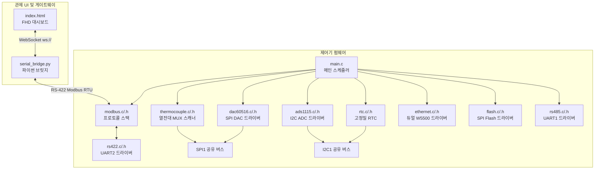

# 🗺️ H2_Control_Board 시스템 의존성 지도 (dependency_map.md)

이 문서는 6kW 및 10kW BOP(Balance of Plant) 제어 시스템의 **dsPIC33CK 펌웨어**와 **PC 관제 UI 대시보드** 간의 구조적 파일 의존성 및 통신 연결성을 한눈에 보여주는 아키텍처 지도입니다.

---

## 🏗️ 1. 전체 아키텍처 개요

시스템은 **임베디드 제어기(Firmware)**, **중계 서버(Python Bridge)**, 그리고 **프론트엔드 대시보드(Control UI)**의 3계층 아키텍처로 구성되어 있습니다.

---

## 📂 2. 모듈별 파일 의존성 상세

### 🔌 2.1. 메인 스케줄러 및 하드웨어 매핑
*   **[main.c](file:///d:/Work/H2_Control_Board/02_Firmware/main.c)**: 시스템의 기동 진입점이며, 200ms 주기로 센서 계측 및 제어 루프를 스케줄링하고 워치독(WDT)을 제어합니다.
*   **[pin_map.h](file:///d:/Work/H2_Control_Board/02_Firmware/pin_map.h)**: dsPIC33CK512MP710 MCU의 물리적 GPIO 핀 정의와 TRIS/LAT 레지스터 매크로를 담고 있어 모든 소스 코드의 하드웨어 종속성을 일원화합니다.

### 🌡️ 2.2. 아날로그 및 센서 계측 모듈 (I2C1 / SPI1 버스 공유)
*   **[thermocouple.c](file:///d:/Work/H2_Control_Board/02_Firmware/thermocouple.c) / [thermocouple.h](file:///d:/Work/H2_Control_Board/02_Firmware/thermocouple.h)**:
    *   **의존성**: `pin_map.h`, SPI1 버스 API 활용.
    *   **역할**: ADG706 아날로그 멀티플렉서 6개를 제어(ADDR0~3, EN1~3)하여 40개 채널의 열전대 기전력을 `MAX31856` 변환 IC로 순차 유도하고 섭씨온도로 계측합니다.
*   **[ads1115.c](file:///d:/Work/H2_Control_Board/02_Firmware/ads1115.c) / [ads1115.h](file:///d:/Work/H2_Control_Board/02_Firmware/ads1115.h)**:
    *   **의존성**: I2C1 공유 버스 API 활용.
    *   **역할**: I2C 버스를 공유하는 4개의 ADS1115 컨버터(IC400~IC403)에서 14개 채널의 아날로그 센서 전압(0~5V, 1~5V)을 계측합니다.
*   **[rtc.c](file:///d:/Work/H2_Control_Board/02_Firmware/rtc.c) / [rtc.h](file:///d:/Work/H2_Control_Board/02_Firmware/rtc.h)**:
    *   **의존성**: I2C1 공유 버스 API 활용.
    *   **역할**: DS3231SN+ 고정밀 RTC 칩셋으로부터 현재 시간을 획득하여 Modbus 레지스터에 기록하고 데이터 로그용 절대 시간을 보증합니다.

### ⚡ 2.3. 전원 및 드라이빙 출력 제어 모듈
*   **[dac60516.c](file:///d:/Work/H2_Control_Board/02_Firmware/dac60516.c) / [dac60516.h](file:///d:/Work/H2_Control_Board/02_Firmware/dac60516.h)**:
    *   **의존성**: `pin_map.h`, SPI1 버스 API 활용.
    *   **역할**: 16비트 16채널 DAC인 DAC60516(IC501)을 SPI 통신으로 제어하여 에어블로어, 수순환 펌프 등의 속도를 제어하는 아날로그 전압(0~5V)을 출력합니다.

### 🌐 2.4. 외부 통신 모듈
*   **[modbus.c](file:///d:/Work/H2_Control_Board/02_Firmware/modbus.c) / [modbus.h](file:///d:/Work/H2_Control_Board/02_Firmware/modbus.h)**:
    *   **의존성**: `rs422.h`, `dac60516.h`, `ads1115.h`, `thermocouple.h`.
    *   **역할**: Modbus RTU Slave 프로토콜을 수행하며, 관제 PC(Master)의 조회 패킷에 대응하여 Input Register(3xxxx)에 계측값을 담아 응답하고 Holding Register(4xxxx) 쓰기 감시를 통해 실제 DAC 및 DO 코일을 스위칭합니다.
*   **[rs422.c](file:///d:/Work/H2_Control_Board/02_Firmware/rs422.c) / [rs422.h](file:///d:/Work/H2_Control_Board/02_Firmware/rs422.h)**:
    *   **의존성**: UART2 하드웨어 모듈.
    *   **역할**: MAX3490을 활용한 Full-Duplex 관제 통신 포트 드라이버입니다.
*   **[rs485.c](file:///d:/Work/H2_Control_Board/02_Firmware/rs485.c) / [rs485.h](file:///d:/Work/H2_Control_Board/02_Firmware/rs485.h)**:
    *   **의존성**: UART1 하드웨어 모듈, `pin_map.h` (DO_485_DIR 송수신 방향핀).
    *   **역할**: MAX3485를 활용한 Half-Duplex 필드 기기(인버터, 개질수 유량계 등) 통신 드라이버입니다.
*   **[ethernet.c](file:///d:/Work/H2_Control_Board/02_Firmware/ethernet.c) / [ethernet.h](file:///d:/Work/H2_Control_Board/02_Firmware/ethernet.h)**:
    *   **의존성**: `pin_map.h`, SPI2 버스 API 활용.
    *   **역할**: SPI2 버스를 공유하는 듀얼 W5500 이더넷 컨트롤러를 기동하고 IP 및 Modbus TCP 게이트웨이 개방 대기를 수행합니다.
*   **[flash.c](file:///d:/Work/H2_Control_Board/02_Firmware/flash.c) / [flash.h](file:///d:/Work/H2_Control_Board/02_Firmware/flash.h)**:
    *   **의존성**: `pin_map.h`, SPI3 버스 API 활용.
    *   **역할**: W25Q256 플래시 메모리와 SPI3 통신을 수행하여 시스템 경보 발생 이력 및 누적 계측 로그를 보존합니다.

---

## 🖥️ 3. PC 관제 UI 및 시뮬레이션 게이트웨이 연동

*   **[index.html](file:///d:/Work/H2_Control_Board/03_Control_UI/index.html)**:
    *   **역할**: 웹 기반의 1920x1025 FHD 통합 관제 대시보드 화면입니다.
    *   **구조**: Vanilla HTML/CSS/JS로 설계되었으며, `serial_bridge.py`와 WebSocket 통신을 통해 실시간 수치(온도, ADC, DI/DO 상태)를 업데이트하고 DAC 슬라이더 및 DO 릴레이 토글 수동 제어 패킷을 송출합니다.
*   **[serial_bridge.py](file:///d:/Work/H2_Control_Board/03_Control_UI/serial_bridge.py)**:
    *   **역할**: PC의 물리 COM 포트(COM3 등)와 웹 대시보드 브라우저(Port 8888)를 중계하는 비동기 파이썬 브릿지 게이트웨이 서비스입니다.
    *   **시뮬레이션**: 실제 하드웨어가 미연결 상태일 때는 난수 데이터를 생성하여 주기적인 MOCK 데이터 프레임을 웹 브라우저로 쏴 대시보드가 단독 기동하도록 가상 에뮬레이터를 구동합니다.

---

## ⚠️ 4. 설계 시 주의점 및 공유 자원 간섭 규칙

1.  **SPI1 공유 버스 간섭**:
    *   `thermocouple.c`와 `dac60516.c`가 SPI1 채널을 공유합니다.
    *   제어 루프 동작 시 각각의 Chip Select 핀(`TC_SPI_CS`, `DAC_CS`)을 배타적으로 제어해야 하며, SPI 통신 속도 및 위상/주파수 설정(SPI Mode)이 다를 경우 반드시 통신 직전에 레지스터 설정을 복원(Re-initialize or Lock)해 주는 기법이 강제됩니다.
2.  **I2C1 공유 버스 간섭**:
    *   `ads1115.c`와 `rtc.c`가 I2C1 하드웨어 채널을 공유합니다.
    *   I2C 슬레이브 주소 충돌 방지: ADS1115(ADDR 핀 주소 0x48~0x4B)와 DS3231(주소 0x68)은 중복되지 않아 안전하지만, 버스 데이터 트랜잭션 도중 예기치 않은 인터럽트가 I2C 상태 머신을 깨뜨리지 않도록 보호 처리가 필요합니다.
3.  **RS-485 방향 전환 타임아웃**:
    *   Half-Duplex 특성상, `DO_485_DIR` 방향핀을 송신(High)으로 전환하여 데이터를 쏘고 난 직후 반드시 송신 시프트 레지스터 비움(UART1 TRMT) 플래그를 대기 감시한 후 수신(Low)으로 내려주어야 패킷 잘림 및 응답 수신 실패를 막을 수 있습니다.
